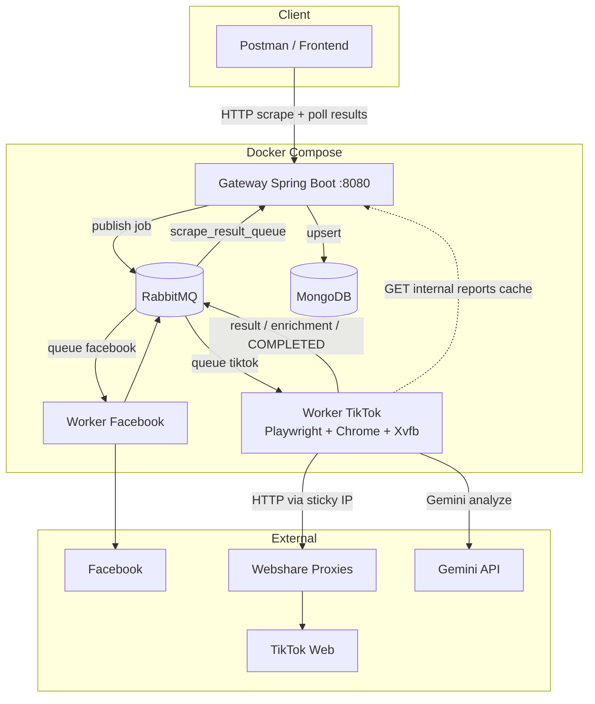
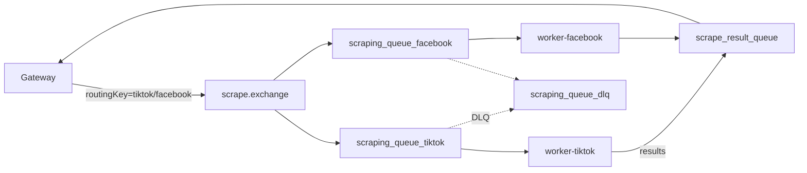
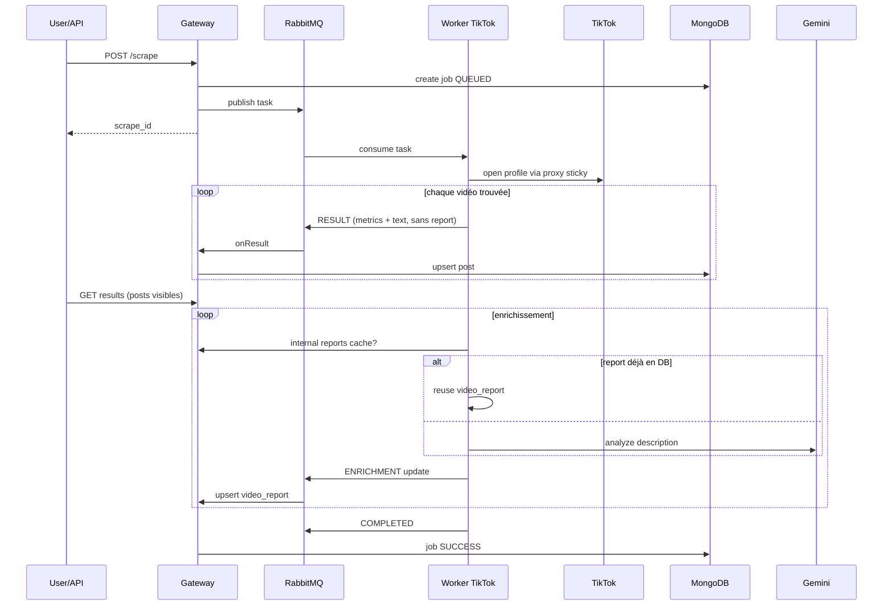
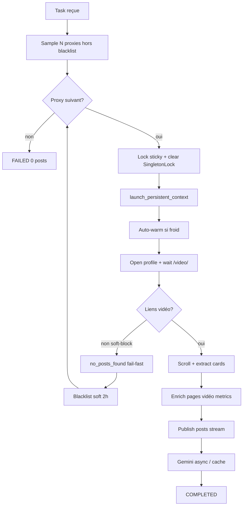
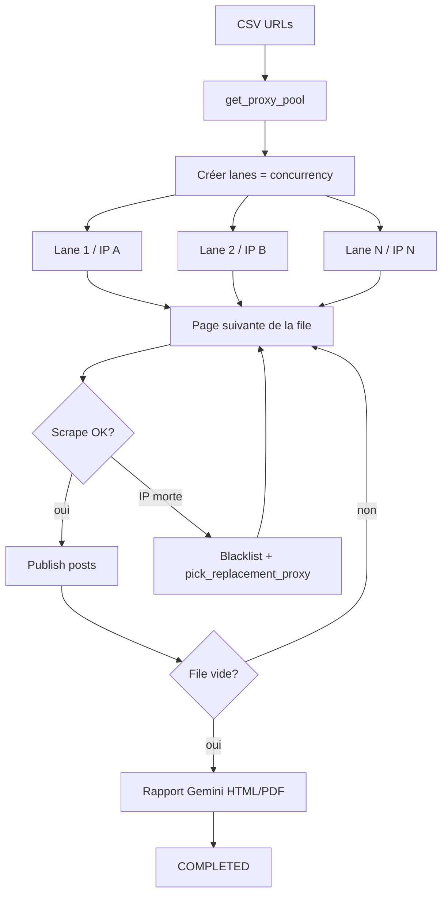
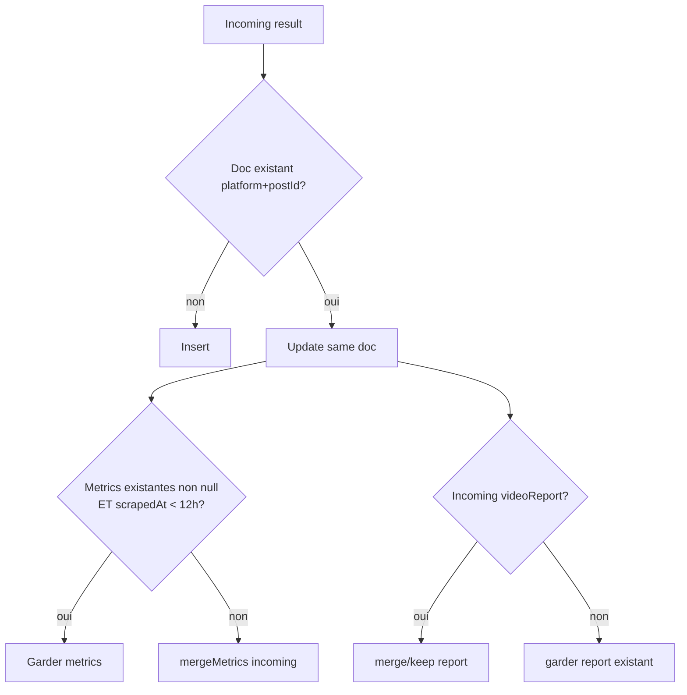
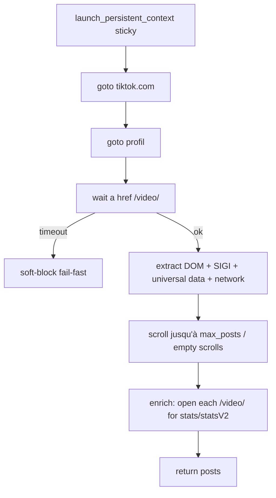

# Handoff développeurs — Facebook / TikTok Scraper

Document de reprise du projet : architecture, flux, choix techniques, problèmes résolus, points d’évolution.

> **Usage Gemini** : coller aussi `docs/PROMPT_GEMINI_RAPPORT.md` + ce fichier pour générer un rapport onboarding plus “présentation”.

---

## 1. Vue d’ensemble

Système de scraping multi-plateforme qui :

1. reçoit une demande via API (profil unique ou CSV),
2. dispatch le travail à un worker via RabbitMQ,
3. scrape des métadonnées de posts (texte, hashtags, likes/vues…),
4. streame les résultats vers MongoDB / API,
5. enrichit ensuite avec Gemini (`video_report`),
6. gère le re-scrape sans historique inutile (1 doc / vidéo).

**Stack**

| Couche | Techno |
|---|---|
| API / orchestration | Spring Boot (gateway) |
| Messaging | RabbitMQ |
| Persistence | MongoDB |
| Workers | Python + Playwright/Chrome |
| IA | Google Gemini |
| Déploiement | Docker Compose |

---

## 2. Architecture globale



### Responsabilités

| Service | Fait | Ne fait pas |
|---|---|---|
| **gateway** | API, jobs, routing Rabbit, upsert Mongo, TTL metrics, cache reports | Ne scrape pas TikTok |
| **worker-tiktok** | Browser scrape, proxies, Gemini, rapports batch | Ne stocke pas la vérité métier (Mongo = gateway) |
| **worker-facebook** | Scrape Facebook via sa queue | — |
| **rabbitmq** | Transport async, découplage | — |
| **mongodb** | Jobs + résultats | Pas d’historique de versions de posts |

---

## 3. Pourquoi cette architecture ? (choix)

### Choix A — Gateway + workers (pas un monolithe scrape-dans-API)

**Pourquoi**
- Le scrape Playwright est long, fragile, CPU/RAM lourd.
- L’API doit rester responsive (créer un job + poll).
- On peut scaler les workers indépendamment.

**Conséquence**
- Toute évolution “métier résultat” passe souvent gateway (Mongo) + worker (payload).

### Choix B — RabbitMQ (pas HTTP synchrone worker←gateway)

**Pourquoi**
- Buffer si TikTok est lent.
- Retry / ACK / DLQ possibles.
- Plusieurs workers / plateformes sans coupler l’API.

**Queues principales**
- Exchange : `scrape.exchange`
- `scraping_queue_tiktok`
- `scraping_queue_facebook`
- `scrape_result_queue`
- `scraping_queue_dlq`



### Choix C — MongoDB 1 document / `(platform, postId)`

**Pourquoi**
- Besoin métier : “état actuel de la vidéo”, pas un journal d’historique.
- Simplifie le cache Gemini (`video_report` stable).
- GET `/scrape/{id}/results` rattache les docs au dernier `scrapeId`.

**Conséquence**
- Un re-scrape met à jour le même document.
- Pas de timeline “metrics hier vs aujourd’hui” sauf si on l’ajoute plus tard.

### Choix D — Streaming results (métadonnées d’abord, Gemini après)

**Pourquoi**
- L’utilisateur voit des résultats tôt.
- Gemini est lent / coûteux ; ne doit pas bloquer l’affichage initial.



### Choix E — Sticky proxy = sticky Chrome profile

**Pourquoi**
- TikTok soft-block si cookies créés sous IP A puis réutilisés sous IP B.
- Solution : `1 sticky Webshare (sdwopfmy-N) = 1 dossier Chrome tiktok_sessions/sdwopfmy-N/`.

**Pourquoi Chrome headed + Xvfb**
- Headless “pur” est plus souvent détecté.
- Xvfb = écran virtuel dans Docker, sans GUI réelle.

### Choix F — Pool 20k + sample + blacklist (pas une seule IP)

**Pourquoi**
- Beaucoup d’IP meurent (tunnel, auth, soft-block).
- Mieux : tester N IP/job, blacklister les mauvaises, continuer.

---

## 4. Déploiement Docker

```text
docker compose up --build
```

Services typiques :

```text
scraper_gateway
scraper_worker_tiktok
scraper_worker_facebook
scraper_rabbitmq
scraper_mongodb
```

Volumes TikTok critiques :

| Volume host | Dans le container | Pourquoi |
|---|---|---|
| `platform/tiktok scraper/tiktok_sessions` | profils Chrome sticky | survivre aux recreate |
| `webshare_residential_proxies.txt` | pool IP | maj sans rebuild |
| `proxy_blacklist.json` | cooldown IP | persistant |
| `video_reports/` | sorties Gemini/PDF | artefacts |

**Piège** : sans volume `tiktok_sessions`, chaque recreate du worker perd les profils chauffés.

---

## 5. Flux profil unique vs CSV

### 5.1 Profil unique (`url` = un @compte)



### 5.2 CSV batch (plusieurs pages)



**Différence clé**

| | Profil unique | CSV |
|---|---|---|
| Proxies | sample séquentiel avec rotation | 1 IP dédiée / lane |
| Parallelisme | 1 scrape thread (+ enrich async) | N lanes |
| Rapport | results API + reports/post | + rapport agrégé batch |

---

## 6. MongoDB — modèle & règles

### Documents typiques

**ScrapeJob**
- `scrapeId`, `status` (`QUEUED|RUNNING|SUCCESS|FAILED`), urls, platform, timestamps

**ScrapeResult** (1 par vidéo)
- `platform`, `postId` (clé logique)
- `scrapeId` (dernier job)
- `author`, `textContent`, `hashtags`
- `metrics` `{likes, comments, shares, views}`
- `videoReport` (Gemini)
- `publishedAt`, `scrapedAt`

### Règles upsert / cache



**Pourquoi TTL 12h sur metrics ?**
- Évite de marteler TikTok pour des likes qui changent peu.
- Exception metrics `null` : sinon un 1er scrape “texte seul” bloquait 12h les vrais likes.

**Pourquoi réutiliser `videoReport` ?**
- Analyse sémantique stable vs métriques volatiles.
- Coût Gemini.

---

## 7. Pool proxies, sélection, blacklist, arrêt à 0

### Sticky mental model

```text
sdwopfmy-42  ──►  IP résidentielle sticky Webshare
             ──►  Chrome profile: tiktok_sessions/sdwopfmy-42/
             ──►  cookies nés sous CETTE IP seulement
```

### Algorithme de sélection (profil unique)

```text
1. Charger pool (~20k)
2. Retirer blacklist active
3. Option: restreindre/prioriser aux N premières sticky (STICKY_POOL_SIZE)
   - si trop peu dispo → compléter depuis le reste du pool
4. Retirer sticky .in_use (autre lane)
5. Prefer warmed, puis cold
6. Shuffle + take PROXY_MAX_PER_JOB (ex: 12)
7. Pour chaque IP:
   - tenter scrape
   - soft-block/auth → blacklist courte + IP suivante (pas de 2e essai inutile)
   - tunnel/timeout → éventuel retry puis blacklist longue
8. Si toutes échouent → FAILED message friendly, count=0
```

### Table blacklist (état actuel)

| Situation | Blacklist ? | Durée défaut | Pourquoi |
|---|---|---|---|
| `no_posts_found` | Oui | **2h** | Soft-block souvent temporaire |
| Challenge/captcha | Oui | **2h** | Idem |
| 403 / HTTP failure | Oui | **24h** | IP brûlée côté TikTok |
| Timeout / tunnel | Oui | **24h** | Proxy mort/instable |
| `INVALID_AUTH_CREDENTIALS` | Oui | **6h** | Auth/quota Webshare |
| SingletonLock / profile in use | **Non** | — | Problème local profil, pas IP |
| Succès | Non | — | — |
| Pause entre pages | Non | — | Normal |

Fichier : `platform/tiktok scraper/proxy_blacklist.json`

### Quand afficher 0 posts

Le worker a épuisé le sample d’IP **sans aucun post publié**.

Réponse API typique :
- `status: FAILED`
- `count: 0`
- message : proxies bloqués / mis en pause, réessayer plus tard

---

## 8. Pipeline scrape TikTok (détail)



### Metrics — pourquoi parfois null ?

1. Grille soft-bloquée : liens OK mais stats absentes.
2. Enrichissement page vidéo échoue (tunnel).
3. Ancien bug gateway TTL (corrigé) : metrics récupérées mais non persistées si doc <12h avec nulls.

### Ce qu’on envoie à Gemini

- Principalement la **description texte** du post.
- Pas un pipeline “download MP4 obligatoire”.
- Donc `confidence.level = low/medium` est **normal** en mode text-only.

---

## 9. Rapports

### Par vidéo
Champ `video_report` :
- themes, executive_summary, sentiment, keywords, safety_flags, confidence_and_limits…

### Batch CSV
- Rapport agrégé “Mauritanie 24h” HTML + PDF
- Gemini sur le lot
- Fallback si timeout Gemini

---

## 10. Logs

`logging_setup.py` → JSON lines :

```json
{
  "timestamp": "...",
  "level": "INFO",
  "logger": "scraper",
  "message": "Video detail enrichment ok likes=16300 views=564600",
  "platform": "tiktok",
  "service": "scraper",
  "url": "https://www.tiktok.com/@.../video/...",
  "post_id": "7388..."
}
```

Conventions :
- soft proxy fail → `WARNING` (pas de stack Playwright)
- bug inattendu → `ERROR` + exception
- corréler via `scrape_id`

---

## 11. Historique problèmes → solutions

| # | Symptôme | Cause racine | Solution implémentée |
|---|---|---|---|
| 1 | Échec immédiat Chrome | `SingletonLock` stale / 2 process même profil | clear Singleton*, `.in_use`, launch dans try, rotate sans blacklist |
| 2 | Profil charge, 0 vidéos | Soft-block grille squelette | wait `/video/`, parse HTML, sticky sessions, fail-fast |
| 3 | Likes null en API alors que logs OK | TTL 12h bloquait update de metrics null | si metrics missing → toujours merge incoming |
| 4 | Enrichissement partiel | `ERR_TUNNEL` pages vidéo | retries enrichissement + `statsV2` |
| 5 | Soft-block massif | cookie global ≠ IP | 1 sticky = 1 Chrome profile |
| 6 | Build Docker / perte sessions | sockets profil / pas de volume | dockerignore + volume sessions |
| 7 | Logs illisibles | stack Playwright | soft errors WARNING |
| 8 | Pool brûlé trop vite | 2×25s wait sur soft-block | fail-fast + no retry same IP + soft blacklist 2h |
| 9 | Gemini redondant | pas de cache | internal reports API + reuse |

---

## 12. Variables d’environnement importantes

| Variable | Rôle |
|---|---|
| `TIKTOK_PROXY_FILE` | chemin pool Webshare |
| `TIKTOK_PROXY_MAX_PER_JOB` | nb IP testées / job |
| `TIKTOK_PROXY_ATTEMPTS_PER_PROXY` | retries réseau flaky |
| `TIKTOK_STICKY_POOL_SIZE` | priorité sur N premières sticky |
| `TIKTOK_STICKY_SESSIONS_*` | enable/dir/LRU |
| `TIKTOK_PROXY_BLACKLIST_HOURS` | cooldown dur (24h) |
| `TIKTOK_PROXY_BLACKLIST_SOFT_HOURS` | cooldown soft-block (2h) |
| `TIKTOK_WAIT_VIDEO_LINKS_MS` | attente grille |
| `TIKTOK_ENRICH_POST_DETAILS*` | enrich metrics pages vidéo |
| `TIKTOK_HEADLESS=false` + `DISPLAY=:99` | Chrome headed Xvfb |
| `TIKTOK_BROWSER_CHANNEL=chrome` | vrai Chrome |
| `TIKTOK_CACHE_REUSE_ENABLED` | reuse Gemini reports |
| `SCRAPE_METRICS_TTL_HOURS` | TTL metrics gateway |
| `GATEWAY_INTERNAL_URL` / `INTERNAL_API_TOKEN` | cache reports |
| `TIKTOK_BATCH_CONCURRENCY` | lanes CSV |

---

## 13. Arborescence utile

```text
Facebook_Scraper/
├── docker-compose.yml
├── .env
├── logging_setup.py
├── scraper/                          # Gateway Spring Boot
│   └── src/main/java/.../
│       ├── api/
│       ├── messaging/listener/ScrapeResultListener.java
│       ├── model/ScrapeResult.java
│       └── repository/
└── platform/
    ├── tiktok scraper/
    │   ├── worker.py                 # consumer + streaming + gemini + csv
    │   ├── scraper.py                # playwright + proxies + sticky
    │   ├── sticky_sessions.py
    │   ├── video_analysis.py         # Gemini
    │   ├── webshare_residential_proxies.txt
    │   ├── proxy_blacklist.json
    │   └── tiktok_sessions/          # profils Chrome
    └── facebook scraper/
        └── ...
```

---

## 14. Debug local — checklist

1. `docker compose ps` — gateway + worker-tiktok + rabbit + mongo healthy
2. Logs worker : `docker compose logs -f worker-tiktok`
3. Chercher : `Selected proxy sample`, `no_posts_found`, `enrichment ok likes=`
4. Vérifier `proxy_blacklist.json` (trop d’IP brûlées ?)
5. Vérifier volume `tiktok_sessions` non vide après un succès
6. Si metrics null : regarder logs enrichissement + TTL gateway
7. RabbitMQ UI `:15672` — messages stuck ?
8. Artefacts : `tiktok_no_posts_found.png` (souvent dans le container)

---

## 15. Pièges à ne pas casser

1. **Ne pas** réinjecter un `tiktok_cookies.json` global sur des IP aléatoires en mode sticky.
2. **Ne pas** lancer 2 Chrome sur le même `tiktok_sessions/<id>/`.
3. **Ne pas** traiter `no_posts_found` comme un succès vide silencieux sans rotation.
4. **Ne pas** relancer Gemini systématiquement si `video_report` existe.
5. **Ne pas** oublier le volume Docker des sessions.
6. **Ne pas** logger les passwords proxies.
7. **Ne pas** remettre TTL metrics sans l’exception “metrics null”.

---

## 16. Évolutions prioritaires suggérées

1. Healthcheck proxy (auth/tunnel) avant d’ouvrir Chrome.
2. Dashboard : taux succès / IP blacklist / durée scrape.
3. Mode “metrics-only refresh” sans Gemini.
4. Historique optionnel des metrics (time-series) si le métier le demande.
5. Téléchargement média réel seulement si confidence Gemini insuffisante.
6. Tests d’intégration : mock TikTok HTML + upsert gateway TTL.
7. Alerte Webshare quota (`INVALID_AUTH` en rafale).

---

## 17. 10 premières tâches pour un nouveau développeur

1. Lire ce handoff + `docker-compose.yml` + `.env`.
2. Monter la stack, scraper `@tawatur` via Postman.
3. Suivre un `scrape_id` dans les logs worker + gateway.
4. Ouvrir Mongo et voir upsert `(platform, postId)`.
5. Relancer le même profil <12h et observer reuse `video_report`.
6. Forcer un soft-block (IP blacklistée) et voir rotation.
7. Lire `sticky_sessions.py` + `launch_persistent_context`.
8. Lire `ScrapeResultListener.upsertResult` (TTL metrics).
9. Lancer un petit CSV batch et voir les lanes.
10. Proposer une PR mineure (log clair / test TTL / doc).

---

*Document généré pour handoff. Mettre à jour ce fichier quand un choix d’architecture change.*
